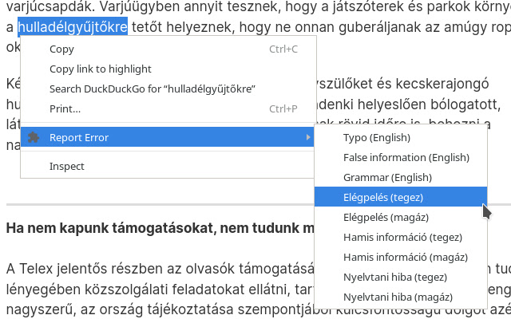

This is a browser extension that helps you report typos or factual errors in articles.

Available for Firefox on [addons.mozilla.org](https://addons.mozilla.org/en-US/firefox/addon/typo-reporter/) and in [the Chrome Web Store](https://chrome.google.com/webstore/detail/typo-reporter/opjniajklmpmmaffnnpfmifnlldglhbf).

Have you ever spotted an annoying little mistake in a news article? Like a simple typo, a sentence that doesn't make sense, or simply a claim that you know is not quite true?

Like me, perhaps you also considered dropping an email to the author to let them know, so they can fix it quickly - but then thought it would be too much work for what it could achieve...

With this extension, all you have to do is select the problematic piece of text in the article, then select a fitting mail template from the context menu. The extension will then extract the title of the article and the name of the author from the page, look up their email address, and open a pre-written email for you addressed to them. All you have to do is add any suggestion for how to fix the problem you found (if you want to), and click "send"!

At the moment it works on articles published on the following sites:
 - 24.hu
 - 444.hu
 - telex.hu
 - phoronix.com
